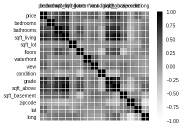

## 项目10：房价回归预测
影响房价的的因素有很多，如面积，楼层高度，地段等等，构建一个机器学习模型预测房价。

项目实现步骤
- 导入数据集：使用 Pandas 库读取数据集 data/data.csv；
- 数据可视化：分析每个影响房价的因素之间的相关性，并绘制各个影响房价因素之间的相关系数矩阵；
  
- 确定与房价最相关的5个影响因素；
- 按照 7:3 的比例划分训练集和测试集以及数据归一化；
- 构建模型：使用 Scikit-Learn 中的线性回归模型来预测房价；
- 模型评估：计算测试集中的模型预测值和真实房价标签之间的平均平方误差（MSE）；

数据描述：第一列是房价（元），第2列-第17列分别是影响房价的16个因素，本项目要求构建一个机器学习模型根据这16个影响房价的因素来预测房价。
