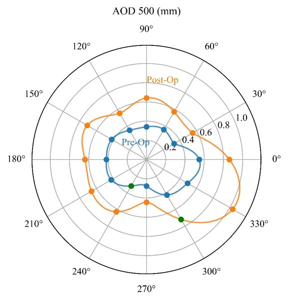

## 项目6：数据清洗项目
项目描述：该项目的目标是进行数据清洗，包括处理缺失值以及对数据进行可视化展示，最后把清洗过的数据保存成excel表格。

项目实现步骤：
- 数据集导入：使用 Pandas 库将数据集导入到 Python 环境中，并进行初步的数据探索和理解；
- 缺失值处理：建议使用scipy中的interp1d插值函数来插值补全缺失值；
- 使用matplotlib，随机挑选两个病人数据进行折线图或者柱状图展示，横坐标是角度，纵坐标是aod值；

技术要点：
- Pandas 库的使用；
- 数据清洗和预处理技巧；
- 数据展示；

数据描述: data/data.xlsx，文件是临床病人眼睛平面的0到360度等角度间隔的临床参数(aod)测量结果, 每一行代表一个病人的数据，eye列是左右眼分类，condition列中after代表手术后测量，
这两列不需要使用，aod_0-330代表不同角度测得的临床参数。 

所以对于同一个病人来说，从0到360度，参数应该具备连续性。因此可以用插值补全。
如下图所示一个病人的一只眼睛的手术前后360度全周AOD测量数据。

上图中橙色点和蓝色点是实际测量值，绿色点是通过样条插值计算的点（这也是本项目要求在原数据Proj6/data.xlsx中补充的插值点）。