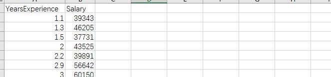

## 项目7：相关性分析
项目描述：该项目的目标是分析某公司员工的工资和工作经验之间的相关性，并确定哪些因素对工资有重要影响。

项目实现步骤
- 使用 Pandas 库读取存储员工工资和工作经验数据的data/data.csv文件；
- 使用 Matplotlib 库对数据集进行可视化，横坐标是工作经验，纵坐标是工资，以帮助分析员工工资和工作经验之间的关系；
- 使用 NumPy 库计算工作经验和工资之间的相关系数，以判断它们之间的相关性；

数据描述：第一列YearsExperience是工作经验年限（年），第二列是工资（元/月）
