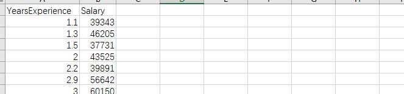

## 项目8：工资回归预测
该项目的目标是建立工作经验和工资之间关系的线性回归预测模型。

项目实现步骤
- 使用 Pandas 库读取存储工作经验和工资数据的data/data.csv文件；
- 划分数据集；按照 7:3 的比例将数据集分为训练集和测试集；
- 使用 Pandas 和 Scikit-Learn 库构建线性回归模型，使用工作经验作为自变量，工资作为因变量；
- 训练模型并对其进行评估，计算模型预测值与测试集中的真实工资标签之间的平均平方误差（MSE），以评估模型的准确度；

数据描述：第一列YearsExperience是工作经验年限（年），第二列Salary是工资（元/月），本项目的要求是构建机器学习模型来通过工作经验来预测工资。
