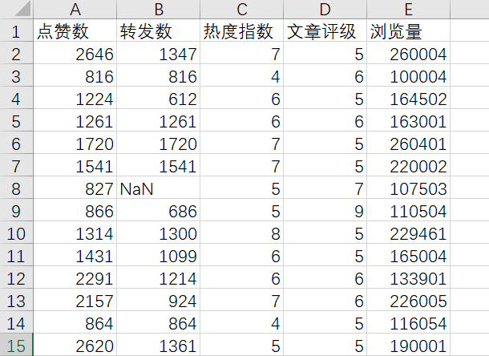

## 项目9： 公众号文章浏览量预测

本项目收集了大量的软文数据，包括点赞数、转发数和浏览量等等，目标是建立一个机器学习模型，根据点赞数和转发数等指标，估计一篇文章能实现多大的浏览量。

项目实现步骤：
- 使用 Pandas 库读取存储软文数据的data/data.csv文件；
- 对数据进行可视化分析，查看数据的分布情况；
- 进行数据清洗：统计包含空数据(NaN值)的数据行数量，并删除这些数据行；
- 按照 7:3 的比例训练集和测试集并对数据进行归一化处理；
- 使用 Scikit-learn 中的线性回归模型构建模型，并进行模型训练；
- 对模型进行评估：计算测试集中模型预测值与真实浏览量标签之间的平均平方误差（MSE）；

数据描述：Proj9/data.csv, 前四列是与文章浏览量相关的的四个重要指标，
最后一列是浏览量，本项目要求构建一下机器学习模型根据这四个重要指标预测文章浏览量。
